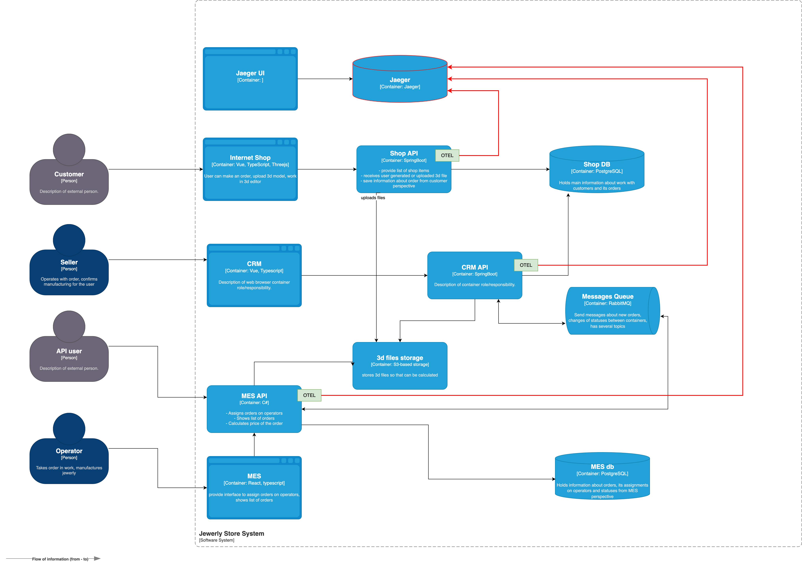

## I. Места, которые следует покрыть трейсингом

1. Взаимодействие между CRM и MES через RabbitMQ: trace_id, user_id, order_id, timestamp, topic
2. Взаимодействие внешних продавцов с API MES: trace_id, client_id, method, endpoint, response_code

## II. Мотивация

Сейчас множество жалоб клиентов потенциально связаны с потерей заказов между системами Невозможно определить, где именно зависают заказы.
Трейсинг помогает отследить проблемные места (например, медленную работу сервиса) и понять в каком именно месте обрывается цепочка.

Метрики, на которые может повлять внедрение трейсинга:
- Уменьшается количество потерянных заказов
- Операторы выполняют свой KPI
- Улучшается SLA 
- Уменьшается время обработки инцидента

## III. Предлагаемое решение

Тех-стек: Jaeger, OpenTelemetry SDK

Новые компоненты: Нужно поднять Jaeger и Jaeger UI

Доработки существующих систем: нужно в CRM API, MES API и Shop API подключить OpenTelemetry SDK и настроить отправку данных о трассировке в Jaeger

Схема:

## IV Компромиссы

Трассировка создает доп. нагрузку и требует места для хранения.
Чтобы меньше нагружать с-му, можно включать трассировку только при необходимости (например, при исследовании конкретного сценария)

## V Безопасность

Опишите, какие меры для предотвращения несанкционированного доступа будут предусмотрены для системы трейсинга внутри компании и снаружи если это требуется.
Например: «Внедрение аутентификации — зайти в систему смогут только сотрудники компании с актуальной учетной записью и ролью “Поддержка”».

Меры защиты:
- аутентификация через AD.
- доступ к трейсингу только из доверенной сети