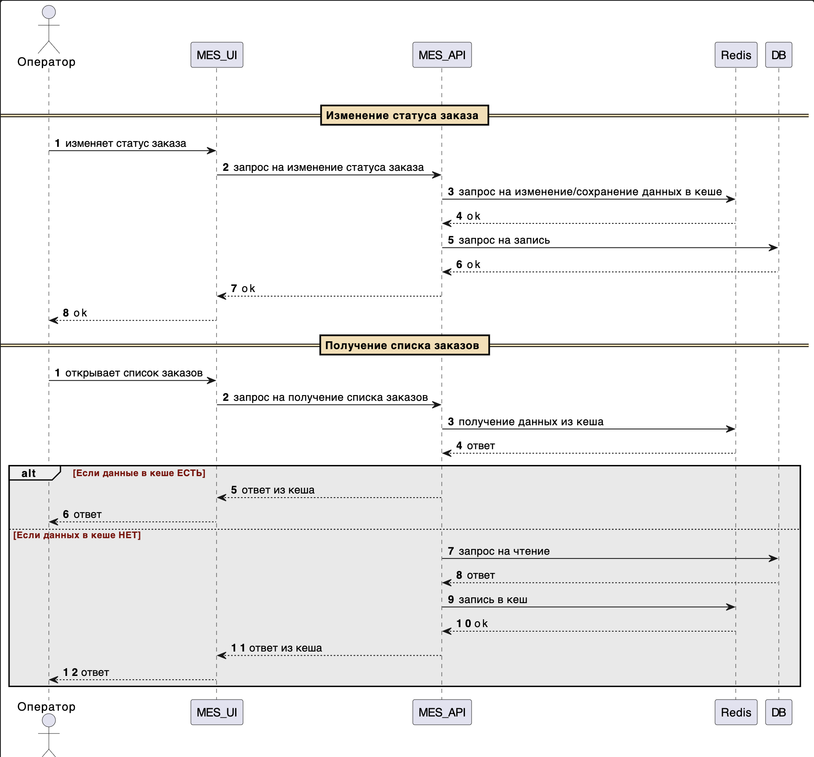

## I. Места, которые следует закешировать

Кеширование можно использовать как на клиентах, так и на бэках.

Ключевые места, где может потребоваться кеширование:
- дашборд в mes (списки заказов по статусам)
- результаты расчетов стоимости в mes

## II. Мотивация

Кеширование уменьшает нагрузку на базу данных и сервисы, ускоряет получение данных и улучшает отзывчивость пользовательского интерфейса.

Сейчас наблюдается высокая нагрузка на MES:
- Дашборд операторов тормозит из-за частых запросов списка заказов. Кеширование поможет ускорить загрузку списка заказов.
- Расчёт стоимости требует от 2 до 30 минут. можно закешировать результаты расчетов и избежать повторных долгих запросов.

## III. Предлагаемое решение

Можно использовать как клиентское, так и серверное кеширование.

Клиентское подойдет для кеширования страниц/картинок/т.д. на клиентских частях: Shop UI, MES UI и CRM UI

Серверное кеширование можно использовать в MES API и CRM API. В первую очередь предлагается реализовать кеширование на беке MES, поскольку с ним связано большинство проблем с производительностью.

### Обоснование выбора паттерна кеширования

Цитата из доки: "Операторам важно видеть самые новые заказы, потому что от этого зависит их вознаграждение"

Поскольку операторам нужно всегда видеть актуальную информацию по заказам, предлагается использовать паттерн Write-Through.

При Write-Through данные между кешем и базой данных всегда будут синхронизированы.

При Cache-Aside может наблюдаться несогласованность данных в кеше с бд, поскольку при записи изменения попадают в БД, а не в кеш. в еше остаются неактуальные данные.

Паттерн Refresh-ahead в целом предоставляет тоже рабочее решение. Правда риск получения старых данных из кеша все равно сохраняется, поскольку кеш обновляется асинхронно.

### Сиквенс

### Стратегия инвалидации кеша

Предлагаемая стратегия: Инвалидация на основе изменений, при которой кеш инвалидируется каждый раз, когда происходят изменения в данных. Данная стратегия подходит, поскольку мы нацелены показывать операторам всега актуальную информацию.

Временная валидация не подходит, поскольку всегда есть риск, что операторы будут видеть неактульную информацию.