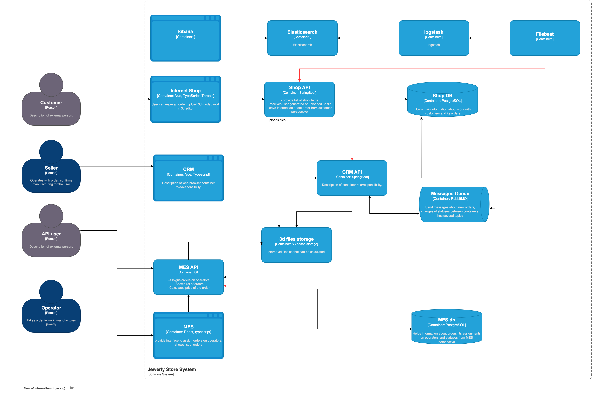

## I Собираемые логи

Опишите, какие логи нужно собирать, и отметьте на схеме, из каких систем требуется сбор логов. Составьте список необходимых логов с уровнем INFO. 
Например, изменение статуса заказа: логируем время, идентификатор покупателя, номер заказа. 
Напишите, будете ли вы использовать другие уровни логирования и при каких обстоятельствах

Аутентификация пользователя: дата

Системы, требующие логирования:
1. Онлайн-магазин:
- действия пользователей:
  -  вход: время, идентификатор покупателя, данные о клиента (браузер, телефон и т.д.
  -  создание заказа: время, идентификатор покупателя, номер заказа
  -  загрузка 3D-модели: время, название загруженного файла, размер файла, id загруженной модели

2. CRM:
- создание заказа, изменения статусов заказов: время, идентификатор покупателя, номер заказа
- Ключевые действия менеджеров (подтверждение заказа, ручное закрытие): дата, операция, идентификатор менеджера

3. MES (React + C#):
   - расчет стоимости заказа: время, покупатель, номер заказа, стоимость
   - входящий запрос в api: время, url/метод/заголовки/тело
   - действия операторов (взятие в работу, завершение производства): дата, операция, идентификатор оператора

Другие уровни логирования:
- все возникающие ошибки логируем с уровнем error/fatal (ошибки при расчете стоимости, при создании заказа, обращении к API и т.д.)
- можем использовать warn для логирования нектритичных ситуаций, но на которые нужно обратить внимание. 
- debug-логи включаем на тестовых стендах и, например, для отладки новых фичей

## II Мотивация

Логирование поможет:
- быстрее искать причины ошибок и разбирать инциденты
- анализировать проблемные места 
- отлаживать новые фичи
- можно использовать для сбора каких-то метрик.

Метрики, на которые может повлять внедрение логирования:
- уменьшение time-to-market у фичей. быстрее тестим, быстрее фиксим, быстрее выпускаем.
- уменьшение среднего времени разбора инцидентов
- KPI выполнения заказов
- уменьшение error rate
- увеличение SLA

Для каких систем нужно настраивать логирование и трейсинг в первую очередь и почему:
- MES, поскольку присутствуют проблемы с расчётом стоимости и дашбордом операторов, есть много жалоб по работе с API
- RabbitMQ – потерянные заказы из-за сбоев очередей.

## III Предлагаемое решение

Опишите, как и с помощью каких технологий будет реализовано логирование, какие компоненты нужно внедрить или доработать. Отразите компоненты и новые связи на схеме.

Проработайте политику безопасности в отношении логов — как будет происходить работа с чувствительными данными, кто будет иметь доступ к логам.

Проработайте политику хранения в отношении логов — будет ли это отдельный индекс под систему, сколько они будут храниться и какого размера будут

Технологии для реализации логирования: ELK-стек (Elasticsearch + Logstash + Kibana)
Схема:

Доступ к логам:
- разработчики/аналитики/тестировщики/продакты имеют доступ только к логам своих сервисов
- поддержка имеет доступ к логам всех сервисов

Политика хранения:
- на тестовом стенде храним логи 1 месяц
- на проде храним данные 3 месяца, потом отправляем логи в архив (на 1 год)

## IV Анализ логов и алертинг

1. Алерты:
- Если расчёт стоимости длится более 5 мин, то отправляем уведомление в mattermost/почту
- Если за минуту > 25 ошибок, то отправляем уведомление в mattermost/почту

2. Аномалия:
- Определяем резкий рост заказов в непривычное время (например, в 3:00 ночи)
- какая-то ошибка повторятся каждый день ровно в 12:00